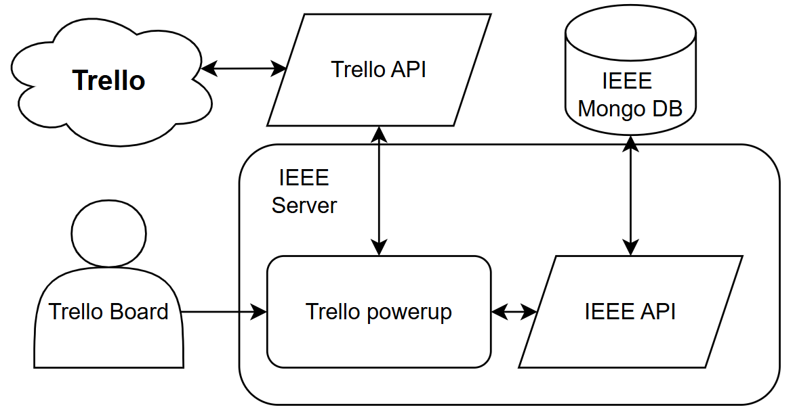

# Trello-relative-due-date

This document will briefly show how you add the relative-due-date power-up to a new IEE CIS Conference team, in order for them to get the proper experience when using the template board, especially generating all tentative dates by only defining the event start date. 

### Adding the power-up

A new Trello team will need to manually add the power-up. The power-up will only be available to people on the team, and not to guests.

There are 5 steps that need to be done in order for the power-up to work properly. The person that creates the power-up also needs to have admin rights on the team. 

1. Go to https://trello.com/power-ups/admin and click the `Create new Power-up` button.
1. Give the power-up a name and make sure it is associated to the right team. In the `iframe connector URL` type `https://ieee.martinnj.com`. This is the server for the power-up and the place that will connect to the team's boards.
1. When the power-up is created you need to define the capabilities of the power-up. These say what the power-up is allowed to do, and where it can display data and perform actions. This is done by clicking on the `capabilities` button on the left sidebar.
1. The different capabilities that needs to be checked, are the following: 

	* Board buttons
	* Card badges	
	* Card buttons
	* Card detail badges

When all the capabilities are added, the power-up should work properly. 

## Architecture
The image below shows the flow of data with the different API's. The IEEE API is used to keep track of the relative due date, as this is not part of the original Trello API. The Trello API is used for everything else, and is required to alter anything that is not part of the relative due date.

Everyting that is part of the IEEE server is part of this project and is running on the server at NTNU. Access can be granted if necessary.
/src contains the actual powerup that is added to trello, and /server contains the API and the server setup to serve the powerup.

